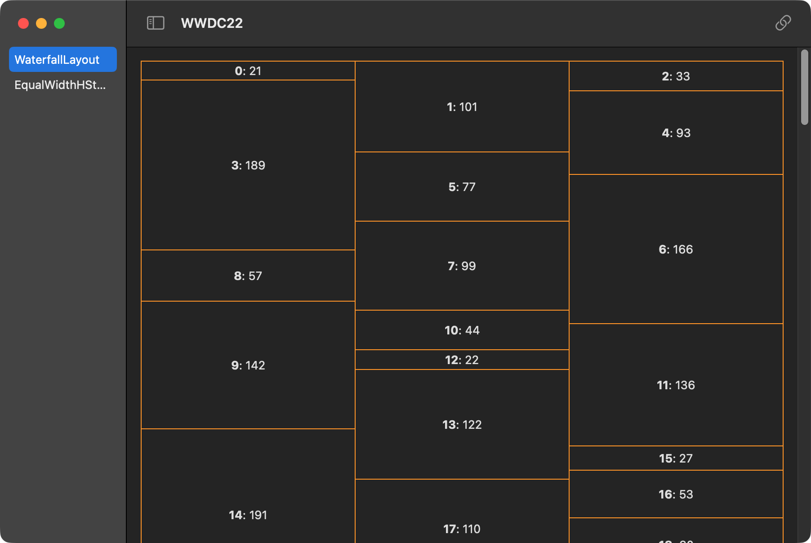

# WWDC 2022's New Stuff in SwiftUI

Here we will explore (hopefully) most new APIs for SwiftUI in macOS 13 and iOS 16, either introduced in the sessions or not.

## Current Plans

As introduced in [What's new in SwiftUI](https://developer.apple.com/videos/play/wwdc2022/10052/), the major updates to SwiftUI
this year include:

- [x] Custom layouts (multi-platform) [2 demos]
- [ ] `Grid` (multi-platform)
- [ ] New navigation APIs (multi-platform)
- [ ] Swift Charts framework (multi-platform)
- [ ] New feature of `TextField` (multi-platform)
- [ ] `Table` (on iPad)
- [ ] Desktop-class toolbar (on iPad)
- [ ] Resizable sheets (on iOS)
- [ ] Multiple windows (on macOS)
- [ ] Status bar window (on macOS)
- [ ] New design of `Form` (on macOS)

This project aims to cover most of the new APIs of the features mentioned above with a set of tiny demos.

## Usage

To see how the UI looks, you can either run the app and select the demos
listed on the sidebar, or see each individually with Xcode Previews.

You can also go directly to the source files to check the implementation details.

## Contribution

Contributions are welcome to make new demos of the uncovered topics (listed as not-finished above) or alternative use cases of the already-covered topics.

If you are to make a new demo, make sure to:

- Document it in detail,
- Put the new source file into a (existing or newly created) group,
- Create a preview in the source file, and
- Make an entry in the split view using the static preview.